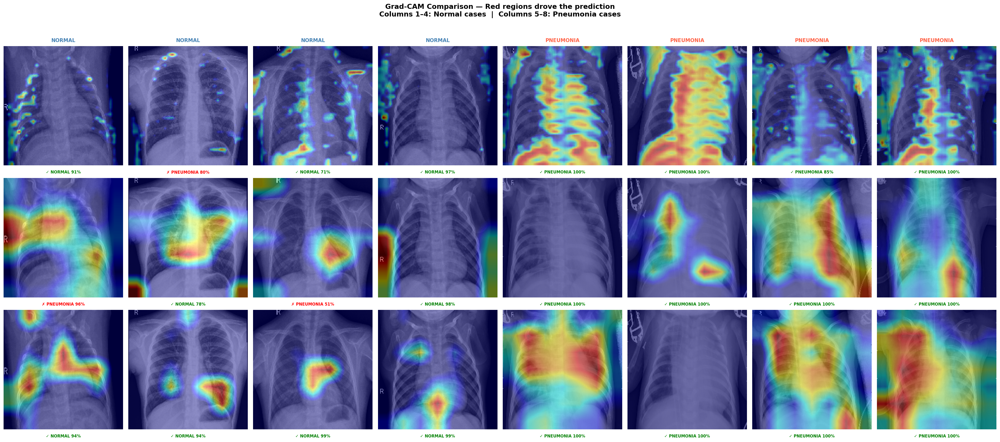

# Pneumonia Detection from Chest X-Rays: Comparison of Deep Learning Architectures

This repository accompanies the study "Pneumonia Detection from Chest X-Rays: An Experimental Comparison of Deep Learning Architectures". It provides all code, notebooks, trained models, and documentation necessary to reproduce the experiments. 


Inside the Notebooks there is the documentation of the whole study explaining everything. (Data_Loading.ipynb -> Exploratory_Data_Analysis.ipynb -> Modeling.ipynb -> Grad_Cam_Comparison.ipynb -> Addressing_Class_Imbalance.ipynb)

---

## Repository Structure

- `RESULTS.md` — Classification Report for each model for every run
- `grad_cam_images/` — Grad-Cam comparison and Failure Analysis images of the models
- `eda_images/` — Exploratory Data Analysis Graphs
- `documentation_images/` — All evaluation plots of each model without class weighting and threshold optimization
- `documentation_images2/` — All evaluation plots of each model with class weighting and threshold optimization
- `logs/`
- `notebooks/` — Jupyter notebooks for each stage of the study:
    - `documentation/` — All evaluation plots of the best runs of each model referenced in the notebooks
    - `Data_Loading.ipynb` — Loading of the Dataset
    - `Exploratory_Data_Analysis.ipynb` — Exploratory Data Analysis
    - `Modeling.ipynb` — Training,Evaluation and Test of the 3 models (Baseline, EfficientNet-B0 and DenseNet-121)
    - `Grad_Cam_Comparison.ipynb` — Gradcam Comparison and Failure Analysis of the 3 models
    - `Addressing_Class_Imbalance.ipynb` — Training,Evaluation and Test of the 3 models with class weighting and threshold optimization (Baseline, EfficientNet-B0 and DenseNet-121)


---

## Dataset

The publicly available Kaggle Chest X-Ray Images (Pneumonia) dataset was used in this study:
**https://www.kaggle.com/datasets/paultimothymooney/chest-xray-pneumonia**

The dataset contains 5,216 training images and 624 test images across two classes (NORMAL, PNEUMONIA). The original Kaggle validation split of 16 images was replaced with a 15% split from the training set (782 images) to provide a statistically reliable evaluation signal.

**Important:** The dataset is not tracked in this repository due to file size. Download it from the link above and place it under `data/` following the structure:

```
data/
├── train/
│   ├── NORMAL/
│   └── PNEUMONIA/
└── test/
    ├── NORMAL/
    └── PNEUMONIA/
```

---

## Requirements

All experiments were executed under Python 3.10. Main libraries:

- `tensorflow` == 2.x
- `numpy`
- `matplotlib`
- `seaborn`
- `scikit-learn`
- `opencv-python`
- `Pillow`

---

## Experimental Design

Each of the three archietectures used in the study (Baseline CNN, EfficientNet-B0 and DenseNet-121) was trained **5 independent times** with identical hyperparameters, data, and augmentation settings — varying only the random weight initialization. Results are reported as mean ± standard deviation across runs rather than as single-run figures, providing a statistically honest characterization of each model's reliability.

A second set of experiments applied **class weighting** (2.9:1 Normal-to-Pneumonia) and **threshold optimization** (0.5 → 0.7) to address the dataset's class imbalance. Each configuration was again evaluated across 5 independent runs.

---

## Results

### Without class weighting (threshold 0.5)

| Model | Accuracy | Normal Recall | Pneumonia Recall | AUC |
|---|---|---|---|---|
| Baseline CNN | 0.816 ± 0.042 | 0.534 ± 0.113 | 0.982 ± 0.008 | 0.949 |
| EfficientNet-B0 | 0.788 ± 0.033 | 0.456 ± 0.093 | 0.992 ± 0.004 | 0.921 |
| DenseNet-121 | **0.884 ± 0.008** | **0.738 ± 0.030** | 0.972 ± 0.008 | **0.974** |

### With class weighting + threshold 0.7

| Model | Accuracy | Normal Recall | Pneumonia Recall |
|---|---|---|---|
| Baseline CNN | 0.866 ± 0.022 | 0.720 ± 0.090 | 0.954 ± 0.030 |
| EfficientNet-B0 | 0.786 ± 0.063 | 0.444 ± 0.186 | 0.990 ± 0.008 |
| DenseNet-121 | **0.896 ± 0.011** | **0.804 ± 0.037** | 0.954 ± 0.011 |

All results are mean ± std across 5 independent training runs.

### Best single run — DenseNet-121 with class weighting + threshold 0.7 (Run 3)
 
```
              precision    recall  f1-score   support
 
      Normal       0.90      0.86      0.88       234
   Pneumonia       0.92      0.94      0.93       390
 
    accuracy                           0.91       624
   macro avg       0.91      0.90      0.91       624
weighted avg       0.91      0.91      0.91       624
```

---

## Grad-CAM Visualization

Grad-CAM heatmaps were generated for all three models on the same set of test images to provide visual interpretability of each model's spatial attention. The comparison reveals qualitative differences in anatomical focus that are consistent with the quantitative results.



---

## Citation

If you use this code or build on these results, please cite:

```
Vasilis Vasileiou, "Pneumonia Detection from Chest X-Rays: An Experimental Comparison
of Deep Learning Architectures", 2025.
```
